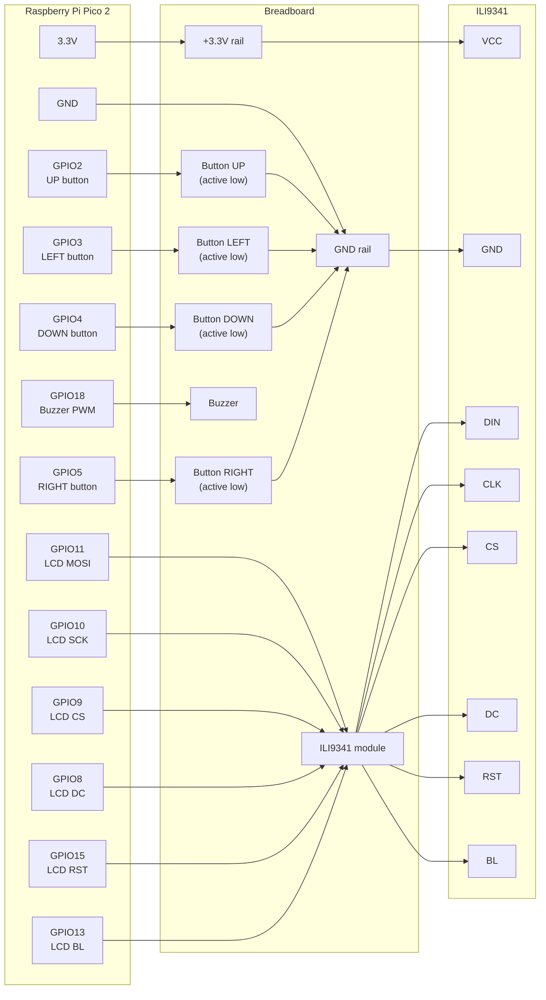

```mermaid

graph LR
    subgraph Raspberry_Pi_Pico_2["Raspberry Pi Pico 2"]
        P33["3.3V"]
        PGND["GND"]
        GPIO2["GPIO2\nUP button"]
        GPIO3["GPIO3\nLEFT button"]
        GPIO4["GPIO4\nDOWN button"]
        GPIO5["GPIO5\nRIGHT button"]
        GPIO8["GPIO8\nLCD DC"]
        GPIO9["GPIO9\nLCD CS"]
        GPIO10["GPIO10\nLCD SCK"]
        GPIO11["GPIO11\nLCD MOSI"]
        GPIO13["GPIO13\nLCD BL"]
        GPIO15["GPIO15\nLCD RST"]
        GPIO18["GPIO18\nBuzzer PWM"]
    end

    subgraph Breadboard["Breadboard"]
        VRAIL["+3.3V rail"]
        GRAIL["GND rail"]
        BTN_UP["Button UP\n(active low)"]
        BTN_LEFT["Button LEFT\n(active low)"]
        BTN_DOWN["Button DOWN\n(active low)"]
        BTN_RIGHT["Button RIGHT\n(active low)"]
        BUZZER["Buzzer"]
        LCD_CONN["ILI9341 module"]
    end

    subgraph ILI9341["ILI9341"]
        VCC
        GND
        DIN
        CLK
        CS
        DC
        RST
        BL
    end

    P33 --> VRAIL
    PGND --> GRAIL

    GPIO2 --> BTN_UP
    GPIO3 --> BTN_LEFT
    GPIO4 --> BTN_DOWN
    GPIO5 --> BTN_RIGHT
    BTN_UP --> GRAIL
    BTN_LEFT --> GRAIL
    BTN_DOWN --> GRAIL
    BTN_RIGHT --> GRAIL

    GPIO18 --> BUZZER

    GPIO11 --> LCD_CONN
    GPIO10 --> LCD_CONN
    GPIO9 --> LCD_CONN
    GPIO8 --> LCD_CONN
    GPIO15 --> LCD_CONN
    GPIO13 --> LCD_CONN

    VRAIL --> VCC
    GRAIL --> GND
    LCD_CONN --> DIN
    LCD_CONN --> CLK
    LCD_CONN --> CS
    LCD_CONN --> DC
    LCD_CONN --> RST
    LCD_CONN --> BL
```
