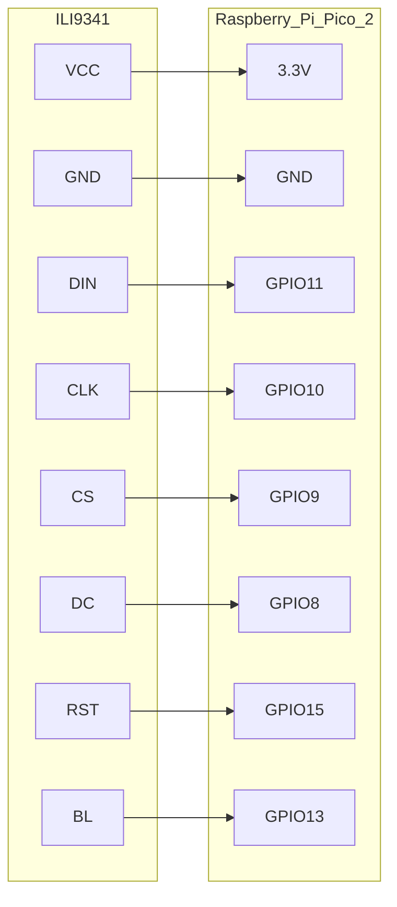

```mermaid

graph LR
    subgraph ILI9341
        VCC
        GND
        DIN
        CLK
        CS
        DC
        RST
        BL
    end

    subgraph Raspberry_Pi_Pico_2
        P33["3.3V"]
        PGND["GND"]
        GPIO11
        GPIO10
        GPIO9
        GPIO8
        GPIO15
        GPIO13
    end

    VCC --> P33
    GND --> PGND
    DIN --> GPIO11
    CLK --> GPIO10
    CS --> GPIO9
    DC --> GPIO8
    RST --> GPIO15
    BL --> GPIO13
```
