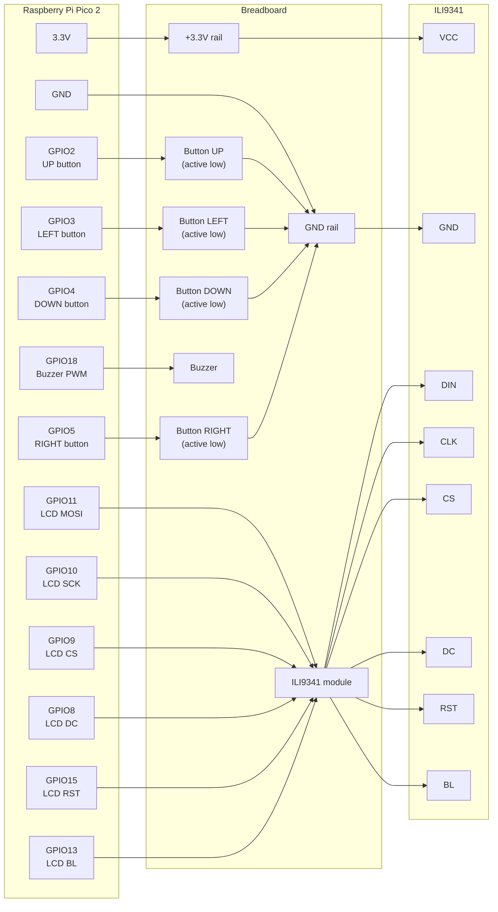

# SSSnake

SSSnake is a classic Snake game for Raspberry Pi Pico 2, shown on an ILI9341 display and controlled with four physical buttons. It combines C++ game logic with a few ARM assembly helpers for fast board and snake operations.

## Features

- 15 x 15 game board rendered on an ILI9341 display,
- four-button directional controls: `UP`, `LEFT`, `DOWN`, `RIGHT`,
- collision detection for walls and the snake body,
- random apple placement on free cells,
- PWM buzzer melody after eating an apple,
- persistent high score stored in Pico flash memory,
- start screen, lose screen, and button-based restart.

## Hardware

You will need:

- Raspberry Pi Pico 2,
- SPI display with an ILI9341 controller,
- 4 momentary push buttons,
- buzzer,
- breadboard and jumper wires,
- 3.3 V power from the Pico.

The buttons are active-low, so each button connects its GPIO pin to ground. The firmware enables the Pico's internal pull-up resistors.

## Wiring

| Part | Pico 2 GPIO | Description |
| --- | --- | --- |
| UP button | GPIO2 | move up |
| LEFT button | GPIO3 | move left |
| DOWN button | GPIO4 | move down |
| RIGHT button | GPIO5 | move right |
| LCD DC | GPIO8 | data/command line |
| LCD CS | GPIO9 | chip select |
| LCD SCK | GPIO10 | SPI clock |
| LCD MOSI / DIN | GPIO11 | SPI data |
| LCD BL | GPIO13 | backlight |
| LCD RST | GPIO15 | display reset |
| Buzzer | GPIO18 | PWM output |



## Building

The project uses Raspberry Pi Pico SDK and CMake. For a clean build:

```powershell
cmake -S . -B build -DPICO_BOARD=pico2
cmake --build build
```

After a successful build, the UF2 file should be available at:

```text
build/SSSnake.uf2
```

## Flashing

1. Hold the `BOOTSEL` button on the Pico 2.
2. Connect the board to your computer over USB.
3. Copy `build/SSSnake.uf2` to the `RPI-RP2` drive.
4. The Pico will reboot automatically and start the game.

## Controls

- `UP`, `LEFT`, `DOWN`, `RIGHT` change the snake direction.
- The game prevents immediate 180-degree turns.
- After losing, press any button to start a new round.

## Project Structure

| File | Role |
| --- | --- |
| `SSSnake.cpp` | main game logic, controls, score, sound, and game loop |
| `ili9341.cpp` / `ili9341.h` | simple ILI9341 display driver |
| `asm_utils.s` | assembly helper functions for board and snake operations |
| `CMakeLists.txt` | Pico SDK build configuration |
| `pico_sdk_import.cmake` | standard Raspberry Pi Pico SDK import file |

## Notes

The high score is stored in the last sector of flash memory. If you change the program memory layout or add your own flash storage, make sure it does not collide with the address used by `HIGHSCORE_FLASH_OFFSET`.
