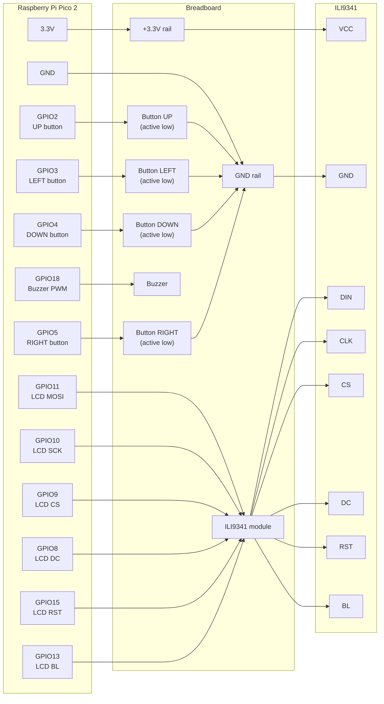

# SSSnake

SSSnake is a Snake game for Raspberry Pi Pico 2. It renders a 15 x 15 board on an ILI9341 SPI display, reads four physical direction buttons, plays a short PWM melody after eating an apple, and stores the high score in Pico flash.

The firmware can also be built in autonomous DQN mode. In that variant, a small neural network trained on a PC is exported to `dqn_weights.h` and compiled into the Pico program.

## Features

- 15 x 15 Snake board rendered on an ILI9341 display.
- Four active-low button inputs: `UP`, `LEFT`, `DOWN`, `RIGHT`.
- Wall and snake-body collision detection.
- Random apple placement on free cells.
- PWM buzzer melody after eating an apple.
- Persistent high score stored in the last flash sector.
- Optional autonomous DQN agent firmware.
- Start screen, lose screen, and restart flow.
- ARM assembly helpers for board clearing, snake movement, collision checks, and apple placement.

## Hardware

You will need:

- Raspberry Pi Pico 2.
- SPI display with an ILI9341 controller.
- 4 momentary push buttons.
- Buzzer.
- Breadboard and jumper wires.
- 3.3 V power from the Pico.

The buttons are active-low: each button connects its GPIO pin to ground. The firmware enables the Pico's internal pull-up resistors.

## Wiring

| Part | Pico 2 GPIO | Description |
| --- | --- | --- |
| UP button | GPIO2 | move up |
| LEFT button | GPIO3 | move left |
| DOWN button | GPIO4 | move down |
| RIGHT button | GPIO5 | move right |
| LCD DC | GPIO8 | data/command line |
| LCD CS | GPIO9 | chip select |
| LCD SCK | GPIO10 | SPI clock |
| LCD MOSI / DIN | GPIO11 | SPI data |
| LCD BL | GPIO13 | backlight |
| LCD RST | GPIO15 | display reset |
| Buzzer | GPIO18 | PWM output |



## Requirements

For the Pico firmware:

- Raspberry Pi Pico SDK.
- CMake.
- ARM GNU toolchain compatible with the Pico SDK.
- `PICO_SDK_PATH` configured, unless your Pico SDK setup already injects it.

For DQN training and export:

- Python 3.11 or another Python version supported by your installed PyTorch build.
- Python dependencies from `ai/requirements.txt`.

```powershell
py -3.11 -m pip install -r ai/requirements.txt
```

## Building

Build the normal button-controlled firmware:

```powershell
cmake -S . -B build -DPICO_BOARD=pico2
cmake --build build
```

The output UF2 should be created at:

```text
build/SSSnake.uf2
```

Build the autonomous DQN firmware:

```powershell
cmake -S . -B build-dqn -DPICO_BOARD=pico2 -DSSSNAKE_ENABLE_DQN=ON
cmake --build build-dqn
```

The DQN output UF2 should be created at:

```text
build-dqn/SSSnake.uf2
```

## Flashing

1. Hold the `BOOTSEL` button on the Pico 2.
2. Connect the board to your computer over USB.
3. Copy the selected `.uf2` file to the `RPI-RP2` drive.
4. The Pico reboots automatically and starts the game.

## Controls

- `UP`, `LEFT`, `DOWN`, `RIGHT` change the snake direction.
- Immediate 180-degree turns are ignored.
- After losing in manual mode, press any direction button to start a new round.
- In DQN mode, the game restarts automatically after a loss so the board can run unattended.

## DQN Agent

The Pico firmware does not run PyTorch. Training runs on your computer, and the trained PyTorch state dictionary is exported to a C++ header.

The model uses:

- 11 input features matching the Pico game state.
- 3 relative actions: straight, turn right, turn left.
- 2 hidden fully connected layers.
- `dqn_weights.h` as the generated firmware header.

Train with the default settings and export weights:

```powershell
py -3.11 ai/train.py --episodes 1000
```

By default, training writes:

| Path | Purpose |
| --- | --- |
| `ai/dqn_snake.pth` | trained PyTorch state dictionary |
| `dqn_weights.h` | generated C++ weights header compiled into firmware |

Resume from an existing model:

```powershell
py -3.11 ai/train.py --resume --episodes 1000
```

Train without exporting the header:

```powershell
py -3.11 ai/train.py --episodes 1000 --no-export
```

Export an existing model manually:

```powershell
py -3.11 ai/export_model.py --model ai/dqn_snake.pth --out dqn_weights.h
```

After export, `DQN_WEIGHTS_READY` in `dqn_weights.h` is set to `true`. If the header contains placeholder weights instead, the DQN firmware uses a conservative fallback path instead of the neural-network policy.

## Project Structure

| File | Role |
| --- | --- |
| `SSSnake.cpp` | main game logic, controls, score, sound, display updates, and game loop |
| `ili9341.cpp` / `ili9341.h` | minimal ILI9341 display driver |
| `asm_utils.s` | ARM assembly helpers for board and snake operations |
| `dqn_inference.cpp` / `dqn_inference.h` | C++ forward pass for exported DQN weights |
| `dqn_weights.h` | generated or placeholder DQN weights compiled into flash |
| `ai/agent.py` | DQN agent, replay memory use, training step, and checkpoint load/save |
| `ai/model.py` | PyTorch DQN network definition |
| `ai/snake_env.py` | headless Snake environment matching the Pico state layout |
| `ai/train.py` | training entry point and automatic export flow |
| `ai/export_model.py` | PyTorch-to-C++ header exporter |
| `ai/requirements.txt` | Python dependency list |
| `CMakeLists.txt` | Pico SDK build configuration |
| `pico_sdk_import.cmake` | standard Raspberry Pi Pico SDK import file |

## Notes

- The firmware sets the system clock to 250 MHz in `main()`.
- The high score is stored at `HIGHSCORE_FLASH_OFFSET`, which points to the last sector of Pico flash.
- If you change the flash layout or add another flash-backed feature, make sure it does not reuse the same sector.
- The maximum score fits in `uint8_t`: a 15 x 15 board with a starting length of 3 leaves 222 apples to collect.
